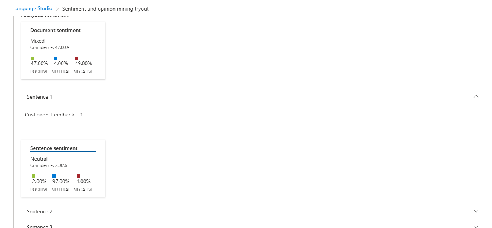

# DIO-linguagem-natural-ia-conversional

Projeto para desafio DIO, módulo Linguagem Natural e IA Conversional

## Processo, insights e possibilidades

### Processo Language Studio

1. Entre no site [Language cognitive](https://language.cognitive.azure.com/home) e faça o login com a mesma do portal azure
2. Escolhi a opção de Classify Text e a opção Analyze sentiment and opinions.
3. após isso clico na opção de Browser for a file ou arrasta o arquivo .txt para o local selecionado, após esse passo, selecione o checkbox e clique em run.
4. Abaixo, mostrará o feedback dos nossos clientes., quantos por cento sao positivos, negativos, etc
   

### Insights e possibilidades

Me apaixonei pela função do speech Language Learn, com ela podemos testar nosso nível de fala, em outro idioma, e no final ele gera um feedback para nós. Mas além disso, temos funções de text to speech ou speech to text, que podem ser usada para gerar bots para pessoas com deficiência visual

Na Ferramenta Language cognitive, é realmente muito boa, mas para o idioma português, precisa de treinamento, mas adorei também.
